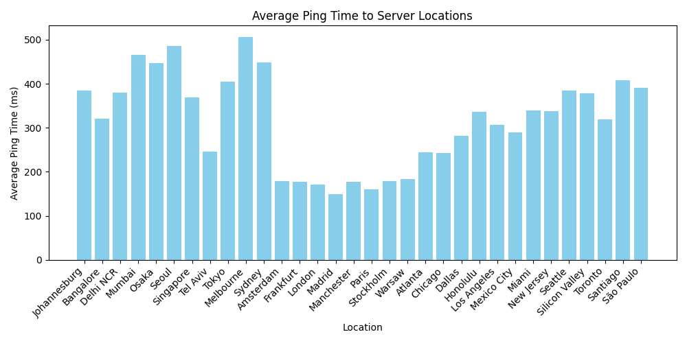

# Geoping

Geoping is a simple Python script that pings a list of server URLs, extracts the average round-trip time, and visualizes the results using a bar chart. This tool is useful for plotting the latency to different server locations.




## Features

- Load server information from a JSON file.
- Ping each server to calculate the average round-trip time.
- Visualize the results in a bar chart with Matplotlib.

## Prerequisites
- Linux! & ping installed
- Python 3.x
- `matplotlib` library for plotting the results

## Installation

1. Clone the repository:

   ```bash
   git clone https://github.com/wraythezw/geoping.git
   cd geoping
   ```

2. Install the required Python packages:

   ```bash
   pip install -r requirements.txt
   ```

## Usage

1. Prepare a `servers.json` file in the following format:

   ```json
   [
       {
           "label": "Region 1",
           "options": [
               {
                   "name": "Server 1",
                   "url": "http://example.com"
               },
               {
                   "name": "Server 2",
                   "url": "http://example.org"
               }
           ]
       },
       {
           "label": "Region 2",
           "options": [
               {
                   "name": "Server 3",
                   "url": "http://example.net"
               }
           ]
       }
   ]
   ```

2. Run the script:

   ```bash
   python geoping.py
   ```

   This will ping each server listed in the `servers.json` file and display the average ping time. It will also generate a bar chart saved as `ping_results.png`.

## Functions

- `load_servers(filename)`: Loads server data from a JSON file.
- `ping_host(hostname)`: Pings a hostname and returns the average round-trip time.
- `extract_hostname(url)`: Extracts the hostname from a URL.
- `main()`: Main function to execute the script logic.

## Output

The script will output the average ping times for each server and generate a bar chart saved as `ping_results.png`. The chart visualizes the average ping times to each server location.

## License

This project is licensed under the GPL-3.0 license - see the [LICENSE](LICENSE) file for details.

## Contributing

Contributions are welcome! Please feel free to submit a Pull Request.

## Contact

For questions or suggestions, please open an issue in this repository.

---

This README provides an overview of the script, instructions for setup and usage, and additional information about the functionalities and output. Adjust the repository URL and contact information as needed for your actual project.